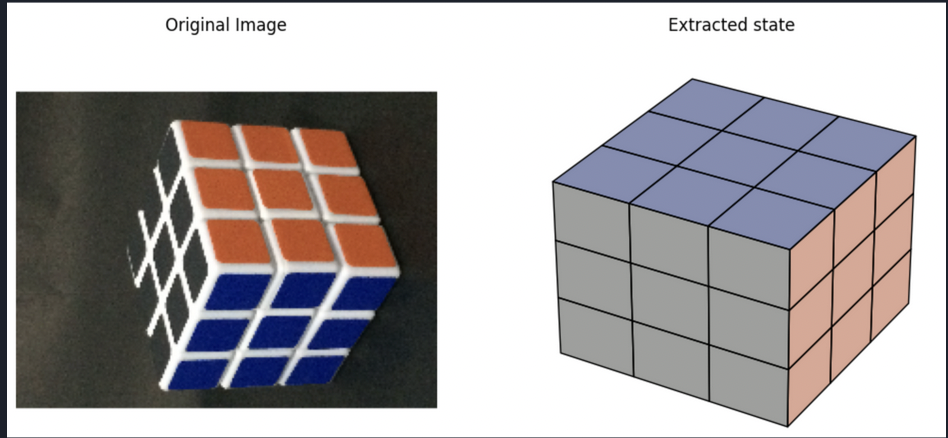
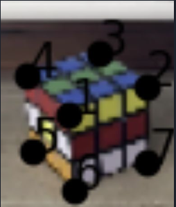
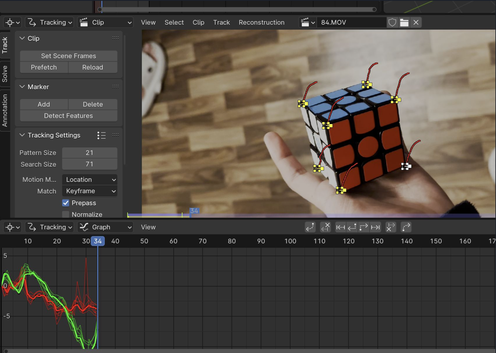
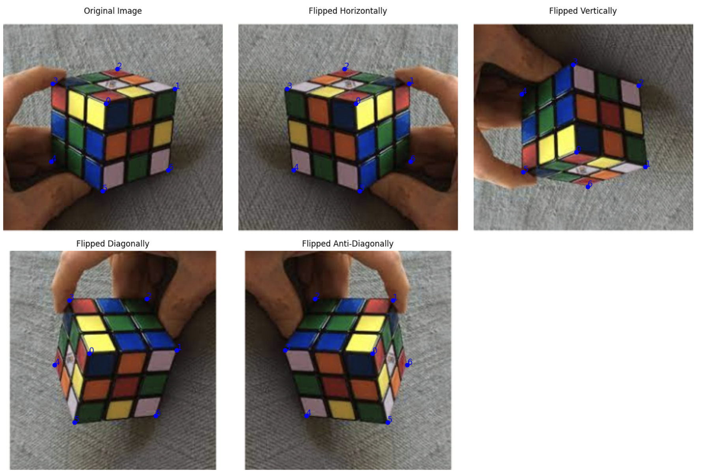
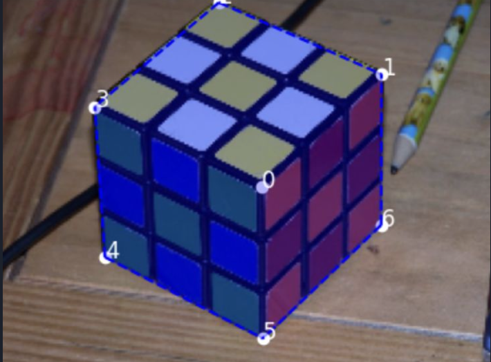
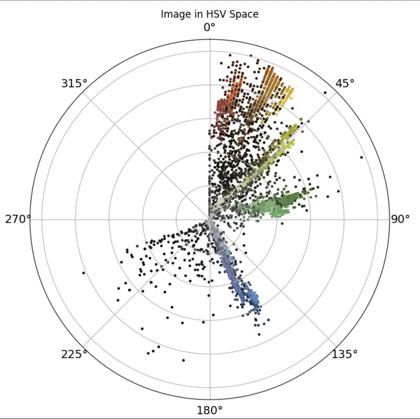
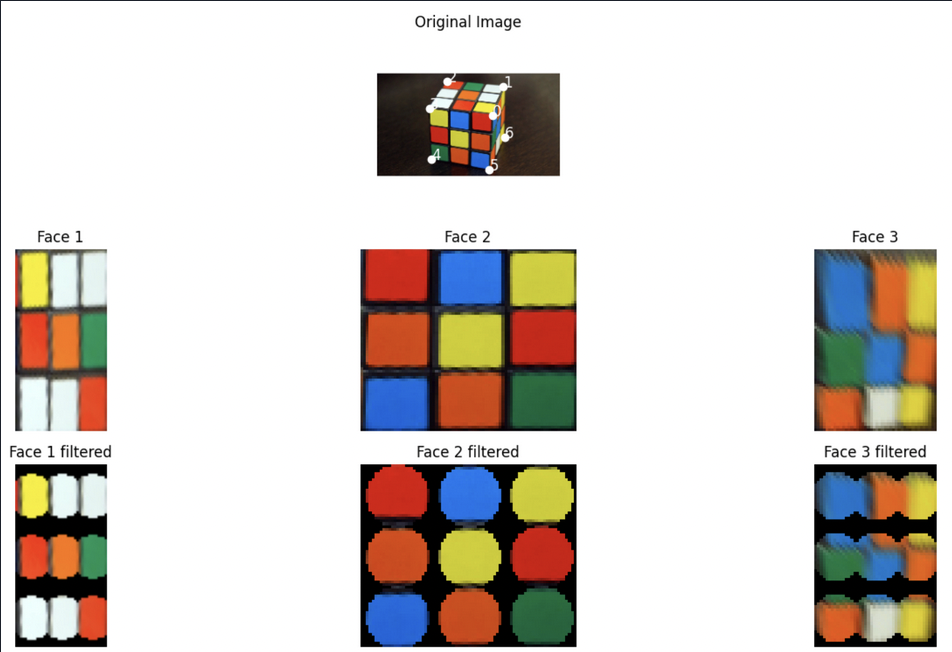

# Rubik's Cube State Recognition

This project focuses on recognizing the state of a Rubik's Cube using computer vision and machine learning techniques. The goal is to extract and classify the cube's sticker colors and reconstruct the full state of the cube based on a single image.

## Project Overview

The work conducted for this project consists of the following steps:

1. **Data Acquisition for Training**:
    - Capturing images of Rubik's Cubes.
    - Acquiring images from the internet.
    - Labeling the images manually (cube corner coordinates).
    - Capturing videos of Rubik's Cubes and tracking the corner locations using Blender to generate a larger dataset.
    
2. **Model Training**:
    - Using a Convolutional Neural Network (CNN) with transfer learning to extract corner coordinates of the cube.
    
3. **State Reconstruction**:
    - Isolating cube faces from the corner coordinates.
    - Performing a perspective transform.
    - Overlaying a mask to extract the individual stickers.
    - Performing color segmentation to determine the cube's state.

## Approach

### 1. Data Acquisition

- **Sources**:
    - Self-captured images (~40).
    - Images from the internet (~600).
    - Motion-tracked images from videos (~400).

- **Labeling**:
    - Manual labeling using Fiji to highlight 7 visible cube corners.
    - Motion tracking of corners in videos using Blender, with data exported via a script (see `VideoData.ipynb`).
    
### 2. Data Preprocessing

- Sorting labels to isolate inner points and reorder corners.
- One corner does not lay on the convex hull formed by all corners; this is labeled as the first corner.
- The remaining corners are labeled in increasing order by rotating counterclockwise around the 0th corner.
- To ensure valid corner quartets for the three cube faces, the center of mass of each quartet is compared to the intersection of the diagonals within a threshold.
- Data augmentation is performed via horizontal, vertical, diagonal, and anti-diagonal flips to increase the dataset size.
  
### 3. Model Training

- **Data Split**:
    - Video data is used exclusively for training to avoid bias in the results.
    - Reflected versions are only added after the training/test split to prevent overlap between the training and test datasets.
    - Training dataset: 2207 samples.
    - Test dataset: 750 samples.

- **Transfer Learning**:
    - The VGG16 model pre-trained on ImageNet is used as the base model.
    - Additional layers are added for corner coordinate extraction.
    - The trained model can be accessed on (`find_corners.keras`)

### 4. State Reconstruction

- Cube faces are isolated using perspective projection.
- Color segmentation is performed in HSV space, clustering pixels into 7 categories using K-Means (sticker colors + background).
- Stickers are classified based on the majority of pixels in each receptive field belonging to a specific color cluster.

## Results

The project achieved partial success in reconstructing the cube's state, though many errors occurred, particularly in color segmentation and face reconstruction. A much larger dataset is needed for the training and a more reliable method for seperating the cube faces should be considered.

## Questions?

For more details, feel free to explore the code and submit issues. 
